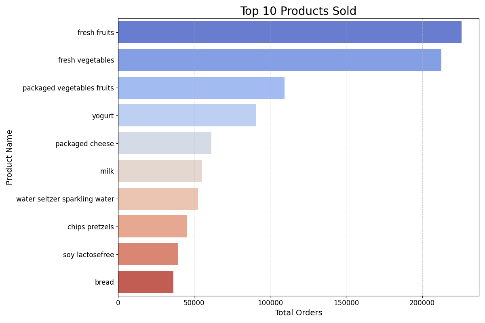

# Supermarket Sales Analysis & Visualization Web App

This project is a **Flask-based web application** for analyzing, forecasting, and visualizing supermarket sales data. It provides interactive dashboards, frequent itemset mining (Apriori algorithm), and insightful visualizations to help supermarkets make data-driven decisions.

## Features

- **Sales Data Upload & Processing:** Upload and process sales data in CSV format for analysis.
- **Interactive Visualizations:** View daily and monthly sales patterns, top-selling products, and more through dynamic charts.
- **Frequent Itemset Mining:** Discover product combinations frequently bought together using the Apriori algorithm.
- **Forecasting:** Generate and visualize sales forecasts (monthly/weekly) to aid inventory planning.
- **User-Friendly Interface:** Clean, responsive web interface with dedicated pages for About, Contact, and Visualizations.

## Project Structure

```
.
├── app/
│   ├── __init__.py
│   ├── main.py
│   ├── apriori.py
│   ├── daily_sales_pattern.py
│   ├── monthly_sales_pattern.py
│   ├── visualization.py
│   ├── xml_processer.py
│   └── __pycache__/
├── data/
│   └── monthly_sales.csv
├── output/
├── pack/
├── result/
│   ├── generated_data.csv
│   ├── monthly_forecast.csv
│   └── weekly_forecast.csv
├── static/
│   └── css/
│       └── reset.css
├── templates/
│   ├── about.html
│   ├── contact.html
│   └── visualization.html
├── uploads/
│   └── generated_data.csv
├── run.py
├── all_products_sales.png
├── top_sales.png
└── README.md
```

## Installation

1. **Clone the repository:**
   ```sh
   git clone https://github.com/yourusername/supermarket-sales-analysis.git
   cd supermarket-sales-analysis
   ```

2. **Install dependencies:**
   ```sh
   pip install -r requirements.txt
   ```
   *Key dependencies:* Flask, pandas, mlxtend, scipy, matplotlib/seaborn

3. **Run the application:**
   ```sh
   python run.py
   ```
   The app will be available at `http://127.0.0.1:5000/`.

## Usage

- **Home Page:** Navigate to the root URL to access the dashboard.
- **Visualizations:** Go to `/visualize` to see sales charts and product trends.
- **Frequent Itemsets:** The app uses the Apriori algorithm to suggest combo offers based on uploaded sales data.
- **Contact/About:** Learn more about the project or get in touch via the `/about` and `/contact` pages.

## Data

- Place your sales data CSV files in the `data` or `uploads` directory.
- Example data columns: `product_name`, `warehouse`, `category`, `date`, `quantity`

## Customization

- **Templates:** Modify HTML files in `templates` for UI changes.
- **Styles:** Edit CSS in `static/css`.
- **Logic:** Add or update analysis logic in `app`.

## License

This project is licensed under the MIT License.

## Acknowledgements

- [Flask](https://flask.palletsprojects.com/)
- [pandas](https://pandas.pydata.org/)
- [mlxtend](http://rasbt.github.io/mlxtend/)
- [scipy](https://www.scipy.org/)

## Screenshots




For questions or contributions, please open an issue or pull request on GitHub.
